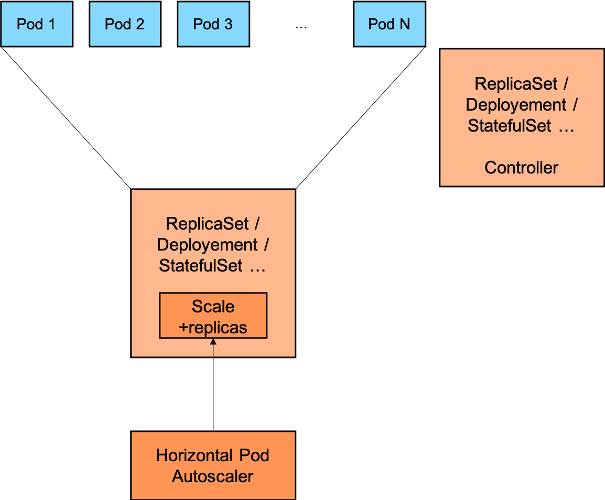
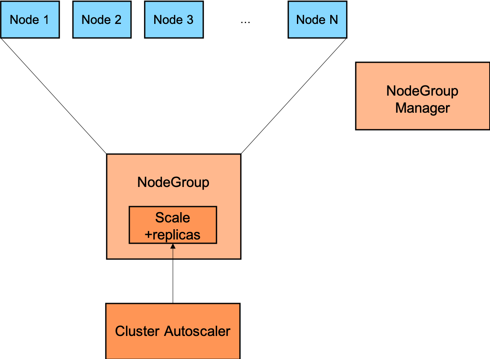
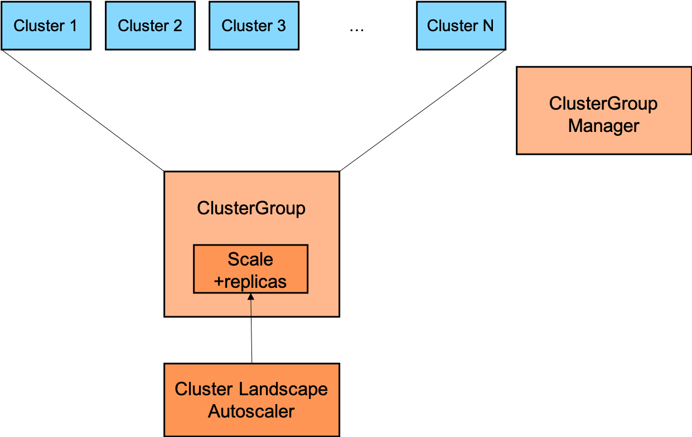

# Service Fabrik Inter-operator Cluster Landscape Autoscaling Architecture

##  Abstract

This document describes the autoscaling aspect of the cluster landscape of the Service Fabrik inter-operator and the different services that it integrates with the [Service Manager](https://github.com/Peripli/service-manager).

This document is about dynamic on-boarding (and off-boarding) new Kubernetes clusters with pre-defined characteristics designed to host the service instances of the different services integrated by a single Service Fabrik inter-operator with the [Service Manager](https://github.com/Peripli/service-manager).

This is document is NOT about any of the following autoscaling aspects.
* The autoscaling of the number of the different kinds of nodes in any given Kubernetes cluster.
This is already covered by the [Cluster Autoscaler](https://github.com/kubernetes/autoscaler/tree/master/cluster-autoscaler).
* The autoscaling of the individual service instances. This is covered in the [performance guidelines](https://github.wdf.sap.corp/CPonK8s/k8s-native-services-concept/blob/master/README.md#performance).

## Target Audience

Architects, Developers, Product Owners, Development Managers who are interested in understanding/using Service Fabrik's inter-operator to expose Kubernetes-based services as [OSB](https://www.openservicebrokerapi.org/)-compliant service brokers and integrate with [Service Manager](https://github.com/Peripli/service-manager).

## Table of Content
* [Service Fabrik Inter\-operator Cluster Landscape Autoscaling Architecture](#service-fabrik-inter-operator-cluster-landscape-autoscaling-architecture)
  * [Abstract](#abstract)
  * [Target Audience](#target-audience)
  * [Table of Content](#table-of-content)
  * [Context](#context)
  * [Motivation](#motivation)
  * [An analogy to the Horizontal Pod Autoscaler](#an-analogy-to-the-horizontal-pod-autoscaler)
  * [An analogy to the Cluster Autoscaler](#an-analogy-to-the-cluster-autoscaler)
  * [Cluster Landscape Autoscaling](#cluster-landscape-autoscaling)

## Context

The [context](basic.md#context) mentioned in the [basic architecture](basic.md) is applicable here.
Also, the [context](cluster-landscape.md#context) mentioned in the [cluster landscape architecture](cluster-landscape.md) is very relevant here.
Especially, the [recommendation](cluster-landscape.md#recommended-landscape-scenario) for the optimal [dedicated](cluster-landscape.md#an-optimal-dedicated-landscape-scenario) or [hybrid](cluster-landscape.md#hybrid-landscape-scenario) is relevant for scaling the number of Kubernetes clusters in a given landscape.

## Motivation

An [recommended](cluster-landscape.md#recommended-landscape-scenario) in the [cluster landscape architecture](cluster-landscape.md), a optimal [dedicated](cluster-landscape.md#an-optimal-dedicated-landscape-scenario) or [hybrid](cluster-landscape.md#hybrid-landscape-scenario) is the preferred landscape for the most common use-cases.

Managing such a landscape with multiple Kubernetes clusters manually can be challenging and can quickly become a bottle-neck.
A more dynamic approach to on-board new Kubernetes clusters with pre-defined set of characteristics can simplify and automate the management of the Kubernetes clusters in the landscape.

## An analogy to the Horizontal Pod Autoscaler

In Kubernetes, the [Horizontal Pod Autoscaler](https://kubernetes.io/docs/tasks/run-application/horizontal-pod-autoscale) performs a role of horizontally scaling the individual [`pods`](https://kubernetes.io/docs/concepts/workloads/pods/pod-overview/) of a [`ReplicaSet`](https://kubernetes.io/docs/concepts/workloads/controllers/replicaset/) or a [`Deployment`](https://kubernetes.io/docs/concepts/workloads/controllers/deployment/) or a [`StatefulSet`](https://kubernetes.io/docs/concepts/workloads/controllers/statefulset/) that is analogous to the problem of dynamically autoscaling the number of Kubernetes clusters of a pre-defined set of characteristics to host service instances of different individual services.

1. The Horizontal Pod Autoscaler keeps checking the specified [metrics](https://github.com/kubernetes/metrics) to identify events which indicate that the current number of replicas in the specified `ReplicaSet` or `Deployment` or `StatefulSet` not sufficient to serve the desired load.
This could be some standard metrics such as CPU utilization and/or some other metrics such as memory utilization or even some custom metrics.  
This is a passive/re-active approach. But, in the future, such scaling events can be triggered based on more active (or even predictive) criteria.
1. The Horizontal Pod Autoscaler determines the number of `pods` by which scale up so that the desired load can be supported.
It updates the [`Scale`](https://kubernetes.io/docs/tasks/access-kubernetes-api/custom-resources/custom-resource-definitions/#scale-subresource)(i.e. the `replicas`) of the target `ReplicaSet` or `Deployment` or `StatefulSet` accordingly.
1. The controller responsible for the target `Scale` resource such as the `ReplicaSet` or `Deployment` or `StatefulSet` controller creates a new set of `pods` which will eventually start serving the load.

This [control-flow](https://kubernetes.io/docs/tasks/run-application/horizontal-pod-autoscale/#how-does-the-horizontal-pod-autoscaler-work) can be depicted as below.

## An analogy to the Cluster Autoscaler

In Kubernetes, the [Cluster Autoscaler](https://github.com/kubernetes/autoscaler/tree/master/cluster-autoscaler) performs a role of scaling the number of [`nodes`](https://kubernetes.io/docs/concepts/architecture/nodes/) in the Kubernetes cluster that is analogous to the problem of dynamically autoscaling the number of Kubernetes clusters of a pre-defined set of characteristics to host service instances of different individual services.

1. The Cluster Autoscaler keeps checking for events which indicate that the current number of nodes in the given Kubernetes cluster is not sufficient to host the desired number of [`pods`](https://kubernetes.io/docs/concepts/workloads/pods/pod-overview/).
Currently, the criteria is a threshold number of `pods` that are marked as [unschedulable](https://github.com/kubernetes/autoscaler/blob/master/cluster-autoscaler/FAQ.md#what-are-the-service-level-objectives-for-cluster-autoscaler) indicating that there are no [`nodes`](https://kubernetes.io/docs/concepts/architecture/nodes/) available to schedule them.
This is a passive/re-active approach. But, in the future, such scaling events can be triggered based on more active (or even predictive) criteria.
1. Among the different `nodegroups` (that define the characteristics of a subset of the `nodes` in the given Kubernetes cluster), the configured [expander](https://github.com/kubernetes/autoscaler/blob/master/cluster-autoscaler/FAQ.md#what-are-expanders) identifies a particular node group to scale up and also the number of `nodes` by which to scale it up so that the desired number of `pods` can be accommodated by the Kubernetes cluster.
1. The Cluster Autoscaler's [`NodeGroupManager`](https://github.com/kubernetes/autoscaler/blob/master/cluster-autoscaler/processors/nodegroups/nodegroup_manager.go) creates a new set of `nodes` which will eventually join the Kubernetes cluster. This will eventually lead the [`kube-scheduler`](https://kubernetes.io/docs/reference/command-line-tools-reference/kube-scheduler/) to schedule the previously unschedulable `pods` on the newly available `nodes`.

This control-flow can be depicted as below.

## Cluster Landscape Autoscaling

To autoscale the cluster landscape, in addition to the `Cluster` resource like the one [defined](https://github.com/kubernetes/cluster-registry/blob/master/cluster-registry-crd.yaml) in the [Cluster Registry](https://github.com/kubernetes/cluster-registry/), a new resource (say, `ClusterGroup`) is required, which captures the at least the following details.
* All the details required to provision new clusters with pre-defined characteristics such as the worker `node`/`machine` types and their autoscaling range.
* The desired [`scale`](https://kubernetes.io/docs/tasks/access-kubernetes-api/custom-resources/custom-resource-definitions/#scale-subresource)(i.e., the number of `replicas` of such clusters).

With this, the following control-flow becomes feasible.
1. The Cluster Landscape Autoscaler keeps checking for events which indicate that the current number of clusters in the given cluster landscape is not sufficient to host the desired number of [`sfserviceinstances`](basic.md#sfserviceinstance) of configured individual services.
Initially, the criteria could be threshold number of `sfserviceinstances` that cannot be scheduled.
This is a passive/re-active approach.
A more active approach could be to pre-allocate some number of clusters as way of buffering.
This can mitigate the latency in in the creation of new Kubernetes clusters.
But, in the future, such scaling events can be triggered based on even more active (or even predictive) criteria.
1. Among the different `clustergroups` (that define the characteristics of a subset of the `clusters` in the given Kubernetes cluster landscape), the Cluster Landscape Autoscaler identifies a particular `ClusterGroup` to scale up and also the number of `clusters` by which to scale it up so that the desired number of `sfserviceinstances` can be accommodated by the Kubernetes cluster landscape.
It updates the `scale` of the `ClusterGroup` accordingly.
1. The Cluster Landscape Autoscaler's `ClusterGroupManager` creates a new set of `clusters` which will eventually join the cluster landscape. This will eventually lead the [`SFServiceInstance Scheduler`](cluster-landscape.md#service-instance-scheduling) to schedule the previously unschedulable `sfserviceinstances` on the newly available `clusters`.

This control-flow can be depicted as below.

Along with the [`SFServiceInstance` scheduler](cluster-landscape.md#service-instance-scheduling), this approach can support all the cluster landscape scenarios discussed [here](cluster-landscape.md#cluster-landscape-scenarios).
